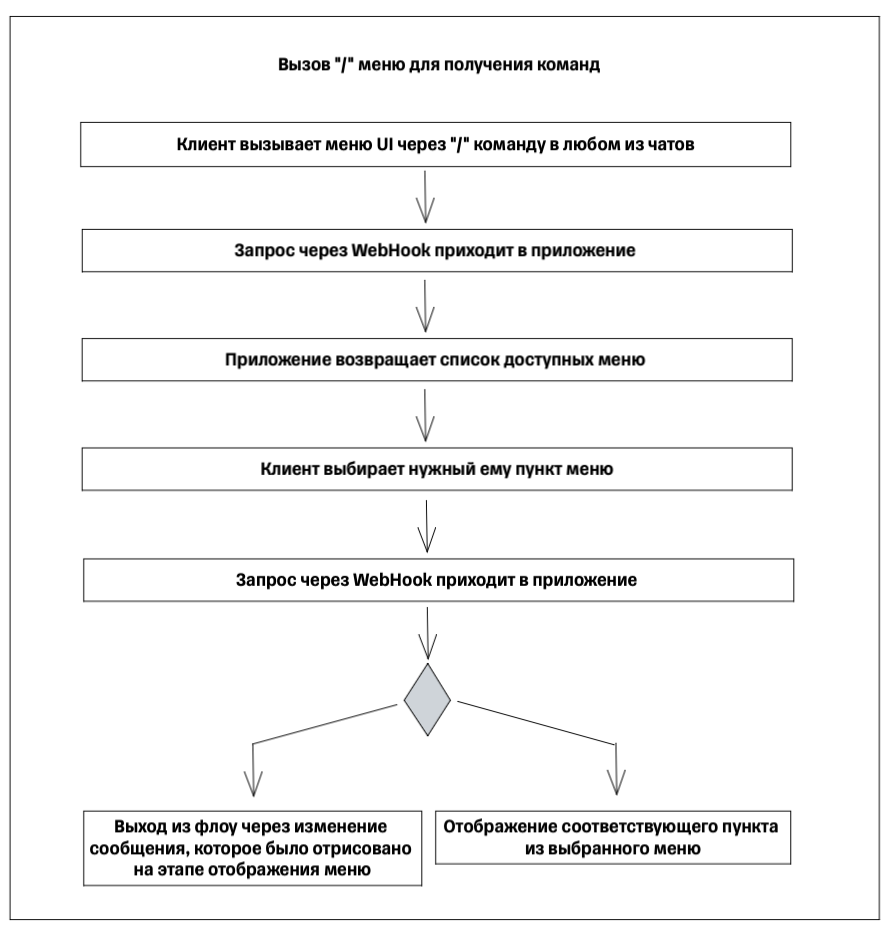

# Изначальная реализация архитектуры конструктора в рамках монолита

Весь workflow определяется в рамках одного сервиса, взаимодействие с которым осуществляется по REST

## Пользовательские сценарии

### Вызов меню UI через "/" команду бота

* Происходит отображение возможных пунктов меню, доступных клиенту

### Создание бота совместно с созданием первого задания для напоминания

* Данный флоу вызывается через "/" команду бота;
* Отображается несколько полей для заполнения данных о новом боте;
* Отображается несколько полей для задачи нового напоминания;

### Добавление новой нотификации для конкретного бота

* Данный флоу вызывается через "/" команду бота;
* Отображается несколько полей для получения данных о боте;
* Отображается несколько полей для задачи нового напоминания;

### Получение списка текущих Job нотификаций

* Данный флоу вызывается через "/" команду бота;
* Отображается поле для получения данных о боте;
* В результате флоу выдается сообщение со списком нотификации, их кратким наименованием и статусом - активны или нет;

### Изменение статуса по существующим Job-ам

* Данный флоу вызывается через "/" команду бота;
* Отображается поле для получения данных о боте;
* Отображаются поля для изменения статуса Job-а;
* В результате флоу выдается сообщение с кратким наименованием и новым статусом Job-а нотификаций;

### Изменение сообщения и расписания существующего Job-а нотификации

* Данный флоу вызывается через "/" команду бота;
* Отображается поле для получения данных о боте;
* Отображается несколько полей для редактирования напоминания;
* В результате флоу выдается сообщение с кратким наименованием и новым расписанием для Job-а;

### Удаление бота

* Данный флоу вызывается через "/" команду бота;
* Отображается поле для получения данных о боте;
* В результате флоу выдается сообщение со списком нотификации, их кратким наименованием и статусом - активны или нет. А также кнопкой подтверждения об удалении джоба;
* Если клиент подтвердил действие - удаляется как бот, так и привязанные к нему Job-ы;

## Общая схема взаимодействия

В рамках данного проекта реализация осуществляется в монолите, внутри которого существуют логические блоки, отвечающие за конкретные зоны ответственности:

* Constructor Layer:
  * Назначение - слой администрирования ботов;
  * Зона ответственности - создание, изменение, удаление ботов;
* Storage Layer:
  * Назначение - слой хранения данных;
  * Зона ответственности - данные авторизации, данные для Job-ов нотификации (канал, краткое название, текст, cron);
* Engine Layer:
  * Назначение - слой реализации запуска Job-ов;
  * Зона ответственности - процесс формирования Job-ов, leader election;
* User Layer:
  * Назначение - слой отрисовки UI меню в Mattermost;
  * Зона ответственности - работа с "/" командами, взаимодействие с клиентом по средствам меню и диалогов.

## Диаграммы последовательности

### Создание бота совместно с созданием первого задания для напоминания

