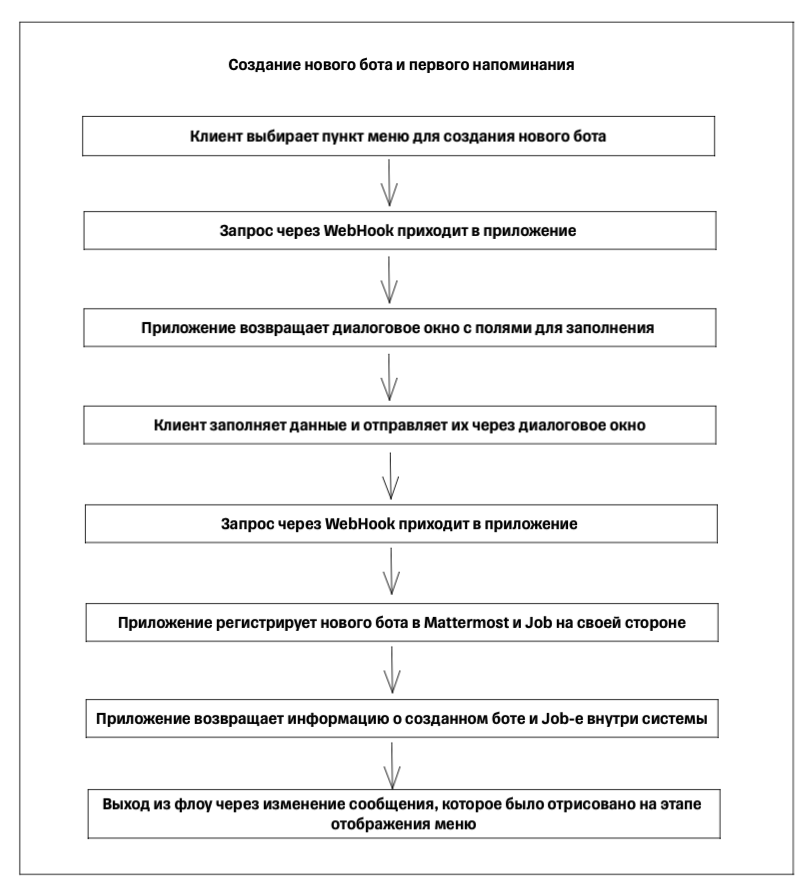
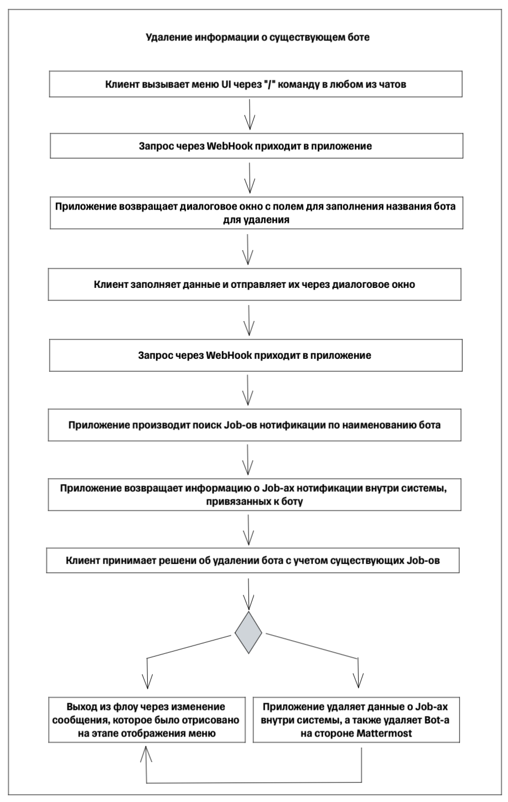

# Первичный вариант реализации архитектуры конструктора

Основой взаимодействия между сервисами является REST, workflow определяется самими сервисами

## Пользовательские сценарии

### Вызов меню UI через "/" команду бота

* Происходит отображение возможных пунктов меню, доступных клиенту

### Создание бота совместно с созданием первого задания для напоминания

* Данный флоу вызывается через "/" команду бота;
* Отображается несколько полей для заполнения данных о новом боте;
* Отображается несколько полей для задачи нового напоминания;

### Добавление новой нотификации для конкретного бота

* Данный флоу вызывается через "/" команду бота;
* Отображается несколько полей для получения данных о боте;
* Отображается несколько полей для задачи нового напоминания;

### Получение списка текущих Job нотификаций

* Данный флоу вызывается через "/" команду бота;
* Отображается поле для получения данных о боте;
* В результате флоу выдается сообщение со списком нотификации, их кратким наименованием и статусом - активны или нет;

### Изменение статуса по существующим Job-ам

* Данный флоу вызывается через "/" команду бота;
* Отображается поле для получения данных о боте;
* Отображаются поля для изменения статуса Job-а;
* В результате флоу выдается сообщение с кратким наименованием и новым статусом Job-а нотификаций;

### Изменение сообщения и расписания существующего Job-а нотификации

* Данный флоу вызывается через "/" команду бота;
* Отображается поле для получения данных о боте;
* Отображается несколько полей для редактирования напоминания;
* В результате флоу выдается сообщение с кратким наименованием и новым расписанием для Job-а;

### Удаление бота

* Данный флоу вызывается через "/" команду бота;
* Отображается поле для получения данных о боте;
* В результате флоу выдается сообщение со списком нотификации, их кратким наименованием и статусом - активны или нет. А также кнопкой подтверждения об удалении джоба;
* Если клиент подтвердил действие - удаляется как бот, так и привязанные к нему Job-ы;

## Общая схема взаимодействия сервисов

В рамках данного проекта можно выделить 4 сервиса, каждый из которых может отвечать за свои конкретные зоны ответственности:

* Bricklayer Constructor:
  * Назначение - сервис администрирования ботов;
  * Зона ответственности - создание, изменение, удаление ботов;
* Bricklayer Storage:
  * Назначение - сервис хранения данных ботов;
  * Зона ответственности - данные авторизации, данные для Job-ов нотификации (канал, краткое название, текст, cron);
* Bricklayer Engine:
  * Назначение - сервис реализации запуска Job-ов;
  * Зона ответственности - процесс формирования Job-ов, leader election;
* Bricklayer BFF:
  * Назначение - сервис отрисовки UI меню в Mattermost;
  * Зона ответственности - работа с "/" командами, взаимодействие с клиентом по средствам меню и диалогов.

## Контракты взаимодействия сервисов друг с другом

### Сервис администрирования ботов

### Сервис хранения данных ботов

### Сервис реализации запуска Job-ов

### Сервис отрисовки UI меню в Mattermost

## Диаграммы последовательности

### Создание бота совместно с созданием первого задания для напоминания

