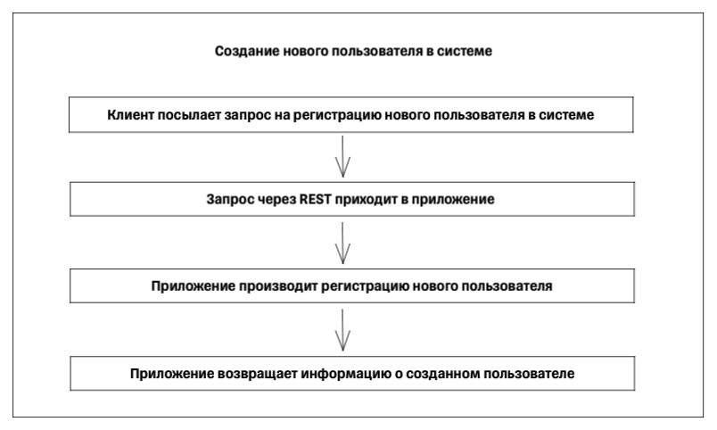
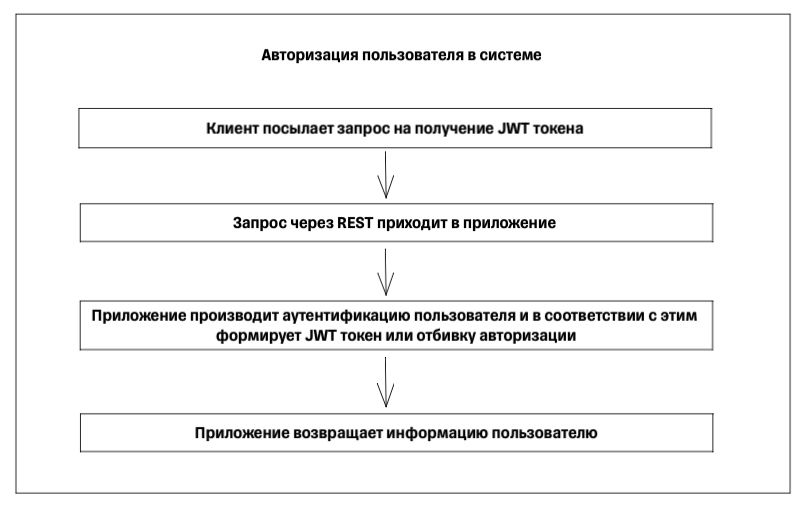
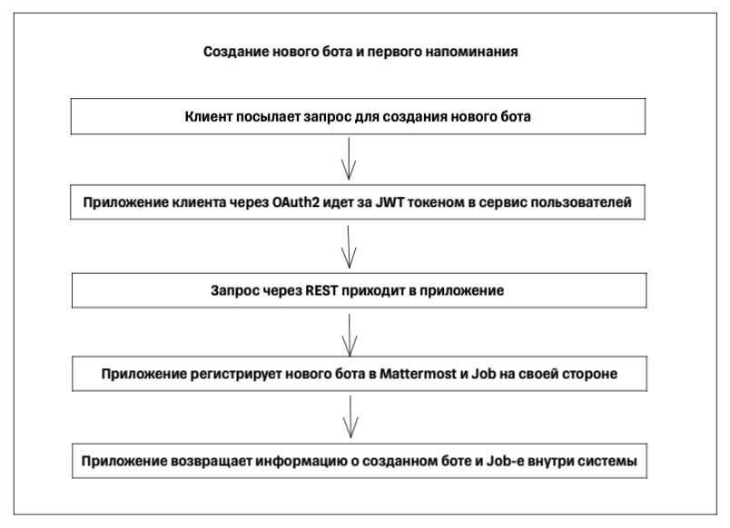
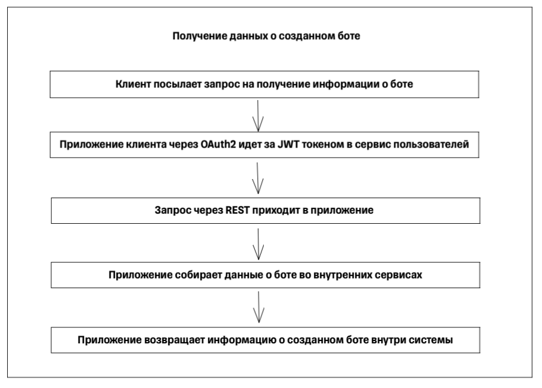
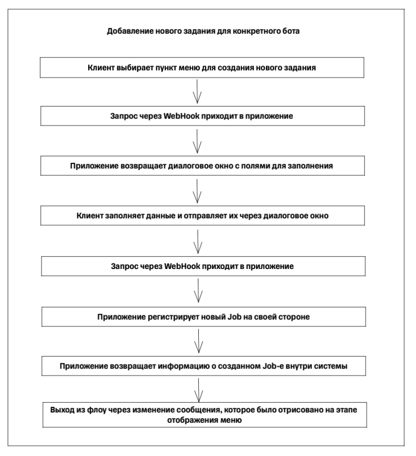
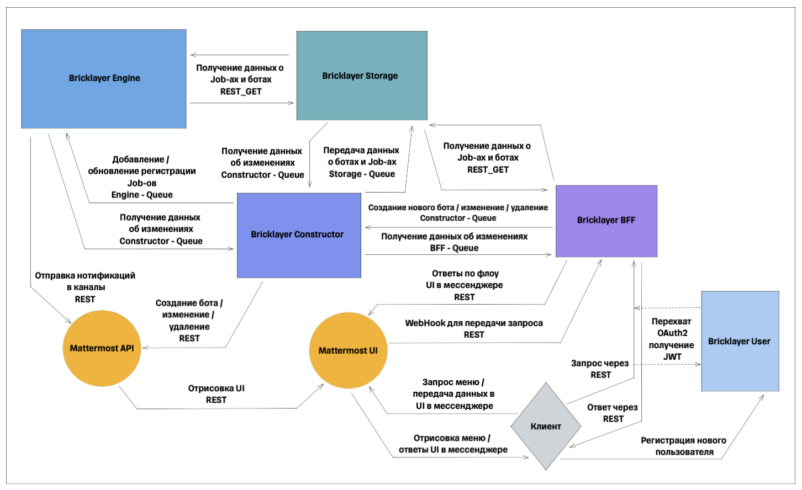
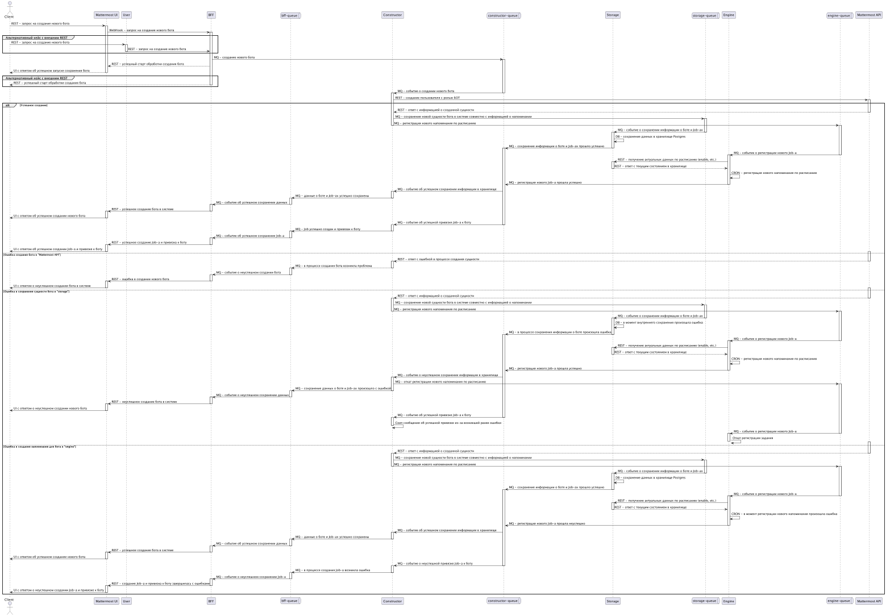

# Третий вариант реализации архитектуры конструктора

Основой взаимодействия между сервисами являются очереди в Kafka, workflow определяется самими сервисами с добавлением реализации Sage паттерна для обработки распределенных транзакций

## Пользовательские сценарии

### Внешнее взаимодействие через REST протокол

В данной архитектуре User Service оставлен для двух внешних запросов - целевой архитектурой является Mattermost UI

#### Регистрация нового пользователя

* Происходит создание нового пользователя внутри системы;

#### Авторизация пользователя в системе

* Происходит аутентификация пользователя и возврат JWT токена при успешном кейсе;

#### Создание бота совместно с созданием первого задания для напоминания

* Данный флоу триггерится через REST запрос;

#### Получение данных о созданном боте

* Данный флоу триггерится через REST запрос;
* В результате флоу выдается сообщение с данными по существующему боту, а также списком нотификаций, привязанных к нему.;

### Внутреннее взаимодействие через UI мессенджера Mattermost

#### Вызов меню UI через "/" команду бота

* Происходит отображение возможных пунктов меню, доступных клиенту

#### Создание бота совместно с созданием первого задания для напоминания

* Данный флоу вызывается через "/" команду бота;
* Отображается несколько полей для заполнения данных о новом боте;
* Отображается несколько полей для задачи нового напоминания;

#### Добавление новой нотификации для конкретного бота

* Данный флоу вызывается через "/" команду бота;
* Отображается несколько полей для получения данных о боте;
* Отображается несколько полей для задачи нового напоминания;

#### Получение списка текущих Job нотификаций

* Данный флоу вызывается через "/" команду бота;
* Отображается поле для получения данных о боте;
* В результате флоу выдается сообщение со списком нотификации, их кратким наименованием и статусом - активны или нет;

#### Изменение статуса по существующим Job-ам

* Данный флоу вызывается через "/" команду бота;
* Отображается поле для получения данных о боте;
* Отображаются поля для изменения статуса Job-а;
* В результате флоу выдается сообщение с кратким наименованием и новым статусом Job-а нотификаций;

#### Изменение сообщения и расписания существующего Job-а нотификации

* Данный флоу вызывается через "/" команду бота;
* Отображается поле для получения данных о боте;
* Отображается несколько полей для редактирования напоминания;
* В результате флоу выдается сообщение с кратким наименованием и новым расписанием для Job-а;

#### Удаление бота

* Данный флоу вызывается через "/" команду бота;
* Отображается поле для получения данных о боте;
* В результате флоу выдается сообщение со списком нотификации, их кратким наименованием и статусом - активны или нет. А также кнопкой подтверждения об удалении джоба;
* Если клиент подтвердил действие - удаляется как бот, так и привязанные к нему Job-ы;

## Общая схема взаимодействия сервисов

В рамках данного проекта можно выделить 5 сервисов, каждый из которых может отвечать за свои конкретные зоны ответственности:

* Bricklayer User:
  * Назначение - сервис администрирования пользователей в системе;
  * Зона ответственности - создание, изменение, удаление пользователей, получение JWT токена авторизации;
* Bricklayer Constructor:
  * Назначение - сервис администрирования ботов;
  * Зона ответственности - создание, изменение, удаление ботов;
* Bricklayer Storage:
  * Назначение - сервис хранения данных ботов;
  * Зона ответственности - данные авторизации, данные для Job-ов нотификации (канал, краткое название, текст, cron);
* Bricklayer Engine:
  * Назначение - сервис реализации запуска Job-ов;
  * Зона ответственности - процесс формирования Job-ов, leader election;
* Bricklayer BFF:
  * Назначение - сервис обработки запросов и формирования ответов для клиентов;
  * Зона ответственности - работа с "/" командами, работа с REST запросами, взаимодействие с клиентом по средствам меню и диалогов.

## Диаграммы последовательности

### Создание бота совместно с созданием первого задания для напоминания

